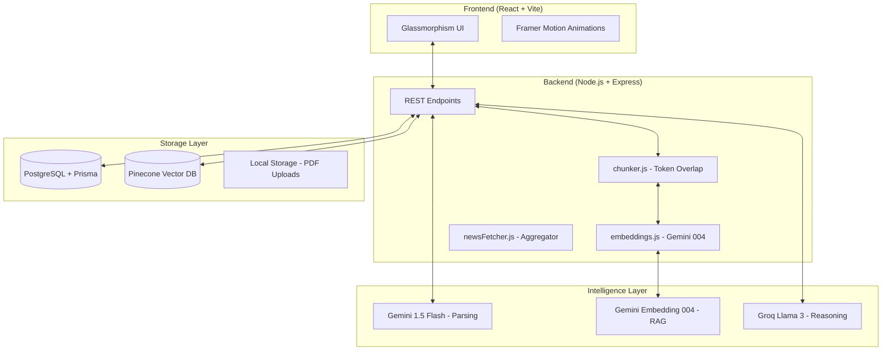

# 🚀 HireAI: Neural-Powered Recruitment Platform

HireAI is a state-of-the-art recruitment infrastructure that leverages **RAG (Retrieval-Augmented Generation)** and multiple LLMs (Gemini & Llama 3) to automate resume screening, semantic talent discovery, and contextual interview preparation.

---

## 🏛️ System Architecture

HireAI follows a decoupled architecture with a focus on high-speed neural processing and semantic data retrieval.

### 1. High-Level Block Diagram


### 2. The RAG Pipeline (Semantic Memory)
HireAI doesn't just store text; it understands it.
1.  **Chunking**: Raw text is split into 500-token blocks with 100-token overlap to maintain semantic continuity.
2.  **Embedding**: Gemini converts blocks into 768-dimensional vectors.
3.  **Indexing**: Vectors are stored in Pinecone across two namespaces: `resumes` and `jobs`.
4.  **Retrieval**: When searching or applying, the system performs a cosine similarity search to find the most relevant context.

---

## ✨ Core Functionalities

### 🛡️ For HR & Recruiters
*   **Neural Resume Analysis**: Instant extraction of skills, match scores, and AI-driven feedback using Gemini 1.5 Flash.
*   **Semantic Talent Search**: A RAG-powered search bar that understands natural language queries (e.g., "Find developers who worked on high-load distributed systems").
*   **Global Market Pulse**: A real-time news aggregator that tracks hiring trends, layoffs, and tech news across the web.
*   **Engine Diagnostics**: Live monitoring of pool match rates and model confidence levels.

### 🎓 For Candidates
*   **Automated Matching**: High-precision compatibility scoring against live job descriptions.
*   **Related Market News**: Personalized news feed based on the candidate's specific skill set found in their resume.
*   **Smart Application**: Upon applying, the system generates 5 personalized interview questions grounded in the specific requirements of the JD.

---

## 🛠️ Technology Stack

| Layer | Technology |
| :--- | :--- |
| **Frontend** | React, Vite, Tailwind CSS (Vanilla CSS Extensions), Framer Motion |
| **Backend** | Node.js, Express, Multer, PDF-parse |
| **Database** | PostgreSQL (Supabase), Prisma ORM |
| **Vector DB** | Pinecone |
| **AI Models** | Google Gemini (Analysis/Embeddings), Groq/Llama 3 (Generation) |
| **Jobs** | Node-cron (News Aggregation) |

---

## 🚀 Installation & Setup

### Prerequisites
*   Node.js v18+
*   PostgreSQL Database
*   API Keys: Gemini, Groq, Pinecone, NewsAPI

### 1. Clone & Install
```bash
git clone <repo-url>
cd resume-screening-platform

# Install Frontend
npm install

# Install Backend
cd server
npm install
```

### 2. Environment Variables
Create a `server/.env` file:
```env
# Database
DATABASE_URL=postgresql://...

# AI Keys
GEMINI_API_KEYS=key1,key2...
GROQ_API_KEY=gsk_...

# Vector DB
PINECONE_API_KEY=...
PINECONE_INDEX_NAME=hireai-index

# Market News
NEWS_API_KEY=...
```

### 3. Database Initialization
```bash
cd server
npx prisma db push
```

### 4. Run Development
```bash
# From root
npm run dev
```

---

## 📂 Project Structure

```text
├── server/
│   ├── lib/
│   │   ├── pinecone.js    # Singleton Vector Client
│   │   ├── embeddings.js  # Gemini Embedding Helper
│   │   ├── chunker.js     # Semantic Text Splitter
│   │   └── prisma.js      # DB Client
│   ├── services/
│   │   └── newsFetcher.js # Multi-source News Scraper
│   ├── jobs/
│   │   └── newsCron.js    # 6-hour refresh schedule
│   └── index.js           # Core Express Neural Engine
├── src/
│   ├── components/
│   │   ├── admin/         # HR Dashboard Modules
│   │   ├── candidate/     # Candidate Portal Modules
│   │   └── shared/        # Universal Components (JobNews, Modals)
│   └── apiConfig.js       # Frontend API Routing
└── prisma/
    └── schema.prisma      # Unified Data Model
```

---

## 📡 API Reference (Summary)

*   `POST /api/candidates`: Upload and vectorize resume.
*   `GET /api/hr/search?q=...`: Perform semantic search over resume pool.
*   `POST /api/jobs`: Create JD and vectorize into job index.
*   `POST /api/applications`: Link candidate and trigger RAG-grounded question generation.
*   `GET /api/news`: Fetch personalized or global job market news.

---

> **Note**: This platform is designed for high-performance recruitment environments. Latency for neural extraction is typically < 2s for complex PDF parsing.
